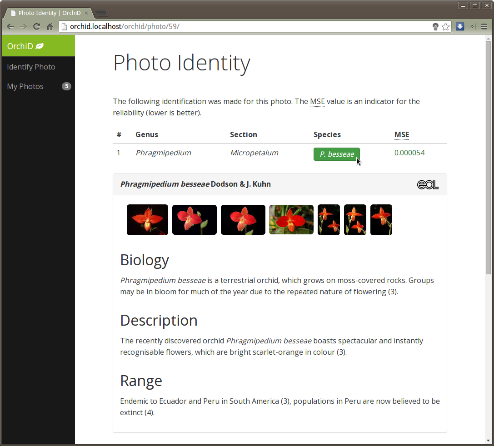
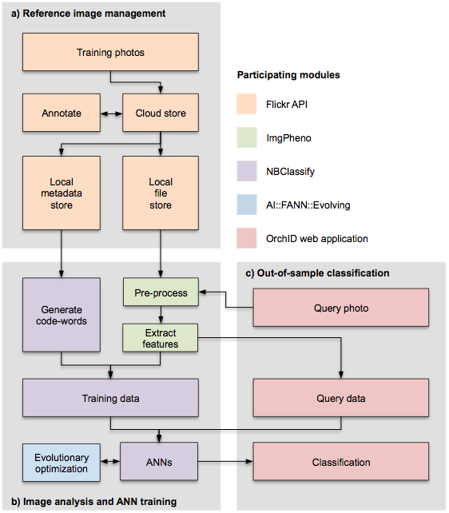

# Taxonomic Classification of Images using ANNs

Naturalis Biodiversity Center has an ongoing interest in the development of methods for
automated image recognition and taxonomic classification. This repository aggregates the
work that has been done (led by @rvosa) to do this in such a way that:
- A generic framework develops that can be applied to a variety of different cases. So
  far these consist of the classification of slipper orchids, and of Javanese butterflies.
  A pilot study to apply the same technology to Culicid mosquitoes is in progress.
- No specific assumptions about, for example, landmarks or other prior knowledge about
  morphology are necessary. Hence image features should be quite generic, although we
  should be able to choose among generic features to select the ones that perform best
  on any given case.
- The taxonomic classification can be approximated if not fully determined. For example,
  it would be useful if an image could at least be classified to the genus level if not
  the species.
- The framework can be presented in a user-friendly way, which includes appropriate 
  presentation and user experience on mobile platforms.
  
## Initial results

The image above demonstrates most of the functionality of the platform thus far. It shows
a results listing page for an attempt to identify an orchid from an image uploaded by the
user. In the case of orchids, three chained neural networks are used:

1. To identify the most probably genus, here _Phragmipedium_, results of which are 
   presented in the second column in the results table.
2. Chained to the results of the genus identification, secondary neural networks identify 
   the section. This is a taxonomic level only in botany, in other groups (e.g. 
   butterflies) this is omitted. The results of these neural networks, here 
   _Micropetalum_, are shown in the third column.
3. Chained to the results of the section identification, tertiary neural networks 
   identify the species, here _Phragmipedium besseae_.
4. The success of the returned species match is expressed as mean square error (MSE) in
   the final column.

When the user clicks on a species name, additional information about that species is
fetched from the [Encyclopedia of Life (EOL)](http://eol.org), which is inserted in a
panel below the results listing.

(In this view, the UI is optimized for a desktop screen. Depending on the user 
agent, an alternate view for mobile screens consists of a single column page, i.e. 
narrower and without the black column on the left, with a 
"[hamburger button](https://en.wikipedia.org/wiki/Hamburger_button)" that expands to
show the user's photo cache.)

## Project resources

The current repository aggregates 
[git submodules](https://git-scm.com/book/en/v2/Git-Tools-Submodules) of projects related 
to image classification. In addition there is:

- a [flickr account](https://www.flickr.com/photos/113733456@N06/) where we collect reference
  images, organize them, and tag them with their taxonomic classification and additional 
  metadata. This is currently password protected as some (orchid) images are copyrighted.
- a [google drive folder](https://drive.google.com/drive/u/0/folders/0B8uRR3rysMcscjdtR0s0bEF2bmc)
  where we have privileged project metadata such as reference materials, progress reports, 
  and so on. This is password protected as it includes privacy-sensitive (student) information.

## Explanation of [git submodules](https://git-scm.com/book/en/v2/Git-Tools-Submodules)

### Currently under active development

The following submodules are currently (February 2017) under active development and/or
are expected to receive additional commits

- [imgpheno](https://github.com/naturalis/imgpheno) - general purpose python library for 
  image segmentation and feature extraction.
- [nbclassify](https://github.com/naturalis/nbclassify) - image classification framework,
  includes interaction with Flickr, with ANNs, and OrchID web application
- [nbclassify-data](https://github.com/naturalis/nbclassify-data) - data repository for
  image metadata, extracted image features, and FANN neural networks.

### Potentially useful but not under active development

The following submodules contain code that is potentially useful at time of writing (February
2017) but is not intended to undergo additional development.

- [ai-fann-evolving](https://github.com/naturalis/ai-fann-evolving) - a genetic algorithm that
  evolves optimal parameterization of ANNs. Written in Perl, as `AI::FANN::Evolving`. Not under 
  active development, ignore.
- [puppet-orchid](https://github.com/naturalis/puppet-orchid) - provisioning scripts to configure
  a web server for OrchID web application. Not under active development, ignore.

### Only here for archival purposes

The following submodules are here for archival purposes because they were presentational
milestones earlier in the project.

- [orchid-presentation](https://github.com/figure002/orchid-presentation) - LaTeX sources to
 generate orchid classification slides. Only here for archival purposes, ignore.
- [orchid-report](https://github.com/naturalis/orchid-report) - LaTeX sources to generate 
  orchid classification report. Only here for archival purposes, ignore.
- [img-classify](https://github.com/rvosa/img-classify) - proof-of-principle to show how ANNs
  can discriminate between beetles and butterflies. Only here for archival purposes, ignore.
